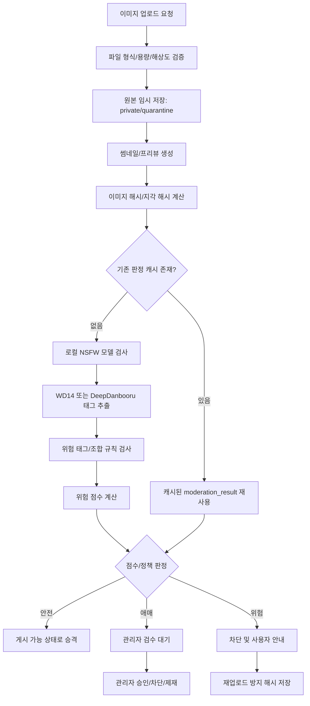
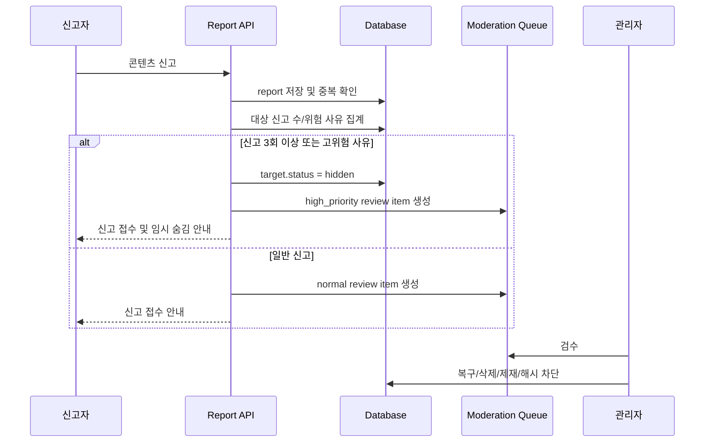

# NSFW/아청법 대응 시스템 설계

이 문서는 오타쿠 커뮤니티에서 이미지, 스티커, 캐릭터 에셋, 게시글 첨부물을 검수하기 위한 NSFW 및 아동·청소년 성착취물 위험 대응 설계다. 구현 시 [editor-media-stickers.md](./editor-media-stickers.md), [moderation-notifications.md](./moderation-notifications.md), [data-model.md](./data-model.md)를 함께 본다.

> 이 문서는 제품/운영 설계 기준서이며 법률 자문이 아니다. 실제 서비스 출시 전에는 국내 법무 검토, 수사기관 협조 절차, 전기통신사업자/정보통신망 관련 의무, 결제/광고 플랫폼 정책을 별도로 확인한다.

## 1. 목표

10duck은 서브컬처 이미지가 많이 오가는 커뮤니티이므로, 일반적인 사진 기반 NSFW 필터만으로는 충분하지 않다. 애니/만화/게임 그림체, 캐릭터 설정, 학교/교복 코드, 로리/쇼타 계열 표현, 성인 게시판 허용 범위를 모두 고려한 다층 검수 구조가 필요하다.

핵심 목표는 다음과 같다.

- 일반 게시판에서는 NSFW 이미지를 차단하거나 관리자 검수로 보낸다.
- 성인 게시판에서는 성인물을 허용하되, 게시판 진입 제한, 성인 인증, 검색/추천 노출 제한, 명확한 라벨링을 적용한다.
- 미성년자로 보이거나 연령 확인이 어려운 성적 콘텐츠는 성인 게시판에서도 허용하지 않는다.
- 아청법 위반 가능성이 있는 콘텐츠는 전체 사이트에서 업로드, 게시, 재게시, 썸네일 노출, 검색 노출을 차단한다.
- AI 기반 자동 검수는 1차 분류와 우선순위 산정에 사용하고, 최종 책임은 운영 정책, 관리자 검수, 신고 대응 체계가 진다.
- 신고 누적, 관리자 조치, 재업로드 시도, 모델 판정 결과를 운영 로그로 남겨 빠른 삭제와 사후 감사가 가능해야 한다.

## 2. 법적/운영 정책 방향

### 기본 원칙

서비스 정책은 "허용 가능한 성인물"과 "절대 금지 콘텐츠"를 명확히 분리해야 한다. 성인 게시판이 있더라도 불법 가능성이 있는 콘텐츠를 허용하는 공간이 되어서는 안 된다.

- 미성년자로 보이거나 연령 확인이 어려운 성적 콘텐츠는 금지한다.
- 외형상 미성년자로 보이면 실제 설정상 성인이라고 주장해도 차단한다.
- 로리, 쇼타, 초등학생, 유치원생, 어린 체형, 아동화된 신체 비율과 성적 맥락이 결합된 콘텐츠는 고위험으로 본다.
- 교복, 학교, 어린이 시설, 아동용 소품 자체가 모두 금지는 아니지만, 노출/성행위/성적 포즈/페티시 맥락과 결합되면 위험도를 크게 올린다.
- 애니 그림체는 실제 인물 사진보다 연령 추정이 어렵기 때문에 "의심스러우면 보수적으로 차단 또는 관리자 검수" 원칙을 적용한다.
- AI 모델은 보조 수단이며, 운영 기준·관리자 교육·신고 대응 SLA·로그 보존 체계가 최종 안전장치다.

### 게시판별 허용 기준

| 구분 | 일반 게시판 | 성인 게시판 | 전체 사이트 공통 금지 |
|------|-------------|-------------|------------------------|
| 일반 이미지 | 허용 | 허용 | 불법/개인정보/저작권 위반은 별도 정책 적용 |
| 선정적 이미지 | 차단 또는 검수 | 성인 인증 후 허용 가능 | 미성년자 의심 결합 시 금지 |
| 명시적 누드/성행위 | 차단 | 정책 범위 내 허용 가능 | 미성년자 의심 결합 시 금지 |
| 로리/쇼타 성적 표현 | 금지 | 금지 | 즉시 차단 및 관리자 기록 |
| 연령 불명 캐릭터의 성적 표현 | 금지 또는 검수 | 기본 검수, 의심 시 금지 | 고위험 태그 결합 시 금지 |
| 신고 다발 콘텐츠 | 자동 숨김 | 자동 숨김 | 관리자 검수 전까지 비공개 |

### 로리/쇼타 계열 위험성

오타쿠 커뮤니티에서는 "가상 캐릭터", "설정상 성인", "합법적 2D"라는 주장이 등장할 수 있다. 하지만 운영 정책은 사용자의 주장보다 플랫폼이 실제로 노출하는 시각적 콘텐츠와 사회적 위험을 기준으로 삼아야 한다.

- 로리/쇼타 태그는 일반적인 미소녀/미소년 그림체와 다르게 미성년자 코드가 강하게 작동한다.
- 성적 노출, 성행위, 속옷 강조, 신체 부위 클로즈업, 성적 대사와 결합되면 전체 사이트 차단 대상으로 본다.
- 캐릭터 프로필에 성인 나이가 적혀 있어도, 외형과 표현이 아동/청소년으로 보이면 차단한다.
- 운영자는 "창작물이라 괜찮다"가 아니라 "서비스가 해당 표현을 유통·추천·보관하는 위험"을 기준으로 판단한다.

### 운영 책임

AI 판정은 자동화 편의를 위한 도구일 뿐, 잘못된 허용이나 과도한 차단에 대한 책임을 모델에 넘길 수 없다. 운영 체계에는 다음이 포함되어야 한다.

- 정책 문서: 금지 콘텐츠, 성인 게시판 허용 범위, 신고 사유, 제재 기준.
- 관리자 교육: 애니 그림체의 연령 모호성, 위험 태그, 오탐/미탐 사례, 긴급 삭제 절차.
- 운영 로그: 자동 판정, 신고, 관리자 조치, 복구, 제재, 재검수 결과.
- 빠른 삭제 체계: 긴급 신고 또는 고위험 판정 시 게시글/미디어/썸네일/캐시를 즉시 비공개.
- 재업로드 방지: 이미지 해시와 지각 해시 기반으로 동일/유사 이미지 재게시를 탐지.
- 이의제기: 오탐으로 차단된 성인 게시판 콘텐츠는 관리자 검수 후 복구 가능하되, 아동·청소년 의심 콘텐츠는 보수적으로 유지.

## 3. 추천 아키텍처

### 업로드 파이프라인



### 저장소 상태 모델

업로드 직후 원본을 공개 버킷에 넣으면, 검사 전이라도 CDN이나 프리뷰 URL로 노출될 수 있다. 따라서 기본 저장소 흐름은 격리 저장 후 승격 방식이어야 한다.

- `quarantine`: 업로드 직후 임시 비공개 저장소. 관리자와 시스템만 접근.
- `processing`: 썸네일 생성, 모델 추론, 해시 계산 중.
- `approved`: 게시 가능한 미디어. 공개 또는 서명 URL 정책 적용.
- `review`: 관리자 검수 대기. 게시글 저장은 가능하되 본문에는 노출하지 않음.
- `blocked`: 차단. 사용자에게 일반화된 사유만 표시하고 내부 상세 판정은 운영자 전용.
- `deleted`: 관리자 또는 작성자 삭제. 정책에 따라 일정 기간 원본/로그 보존 후 삭제.

### 판정 레이어

1차 판정은 비용이 낮고 지연이 짧은 로컬 모델로 수행한다. 2차 판정은 고위험 또는 애매한 케이스에만 유료 API를 사용한다.

- 파일 검증: MIME, 확장자, 매직 넘버, 이미지 디코딩 가능 여부, SVG 금지.
- 해시 검사: SHA-256 원본 해시, pHash/dHash 기반 유사 이미지 탐지.
- 로컬 NSFW: nudity, explicit, suggestive, safe 등 기본 성적 수위 추정.
- 태그 추출: WD14/DeepDanbooru로 애니 특화 태그 추출.
- 정책 규칙: 위험 태그, 태그 조합, 게시판 등급, 사용자 연령 인증 상태.
- 외부 API: Hive Moderation, OpenAI Moderation 등으로 애매하거나 고위험인 이미지 재검증.
- 관리자 큐: 자동 판정 신뢰도가 낮거나 법적 위험이 큰 콘텐츠는 인간 검수로 전환.

## 4. 추천 기술 스택

| 기술 | 역할 | 장점 | 단점/주의점 | 추천 사용 위치 |
|------|------|------|-------------|----------------|
| NudeNet | 이미지 누드/신체 노출 탐지 | 로컬 실행 가능, 비용 낮음, 기본 NSFW 필터에 적합 | 애니/일러스트 특화가 약할 수 있음, 미성년자 여부 판단 불가 | 1차 로컬 NSFW 필터 |
| WD14 Tagger | 애니/일러스트 태그 추출 | Danbooru 계열 태그에 강함, `loli`, `school_uniform` 등 도메인 태그 감지에 유리 | 태그가 확률적이며 맥락 판단은 약함, 운영 규칙과 결합 필요 | 1차 태그 기반 위험도 계산 |
| DeepDanbooru | 애니 이미지 태그 추출 | 오래된 생태계와 자료가 많고 자체 운영 가능 | 최신 모델 대비 품질 편차, 태그 노이즈 가능 | WD14 보조 또는 대체 |
| Hive Moderation API | 상용 이미지/텍스트 모더레이션 | 운영형 API, 성인/폭력/아동 안전 카테고리 제공 가능, SLA 기대 | 비용 발생, 외부 전송에 따른 개인정보/저작권 검토 필요 | 2차 고위험/애매 케이스 |
| OpenAI Moderation API | 텍스트/이미지 모더레이션 보조 | 통합 API로 정책 위반 가능성 분류에 활용 가능 | 애니 특화 태그 추출 도구는 아니며 최종 판단 불가 | 신고 상세, 게시글 텍스트, 애매 이미지 보조 판정 |

### 조합 전략

초기에는 `NudeNet + WD14 Tagger + 규칙 엔진`을 기본으로 둔다. 트래픽이 늘거나 오탐/미탐 사례가 쌓이면 Hive/OpenAI 같은 외부 API를 2차 판정으로 붙인다.

- 일반 게시판 이미지: 로컬 NSFW 점수가 높으면 차단 또는 검수.
- 성인 게시판 이미지: 로컬 NSFW는 허용 판단에 쓰되, 위험 태그가 있으면 차단/검수.
- 태그 기반 고위험: `loli`, `shota`, `child`, `kindergarten` 등은 외부 API 또는 관리자 검수로 승격.
- 반복 신고 이미지: 해시를 기준으로 재검수 없이 자동 숨김 또는 차단.

## 5. 위험 태그 정책

### 위험 태그 예시

| 태그 | 위험도 | 정책 의미 |
|------|--------|-----------|
| `loli` | 매우 높음 | 미성년자처럼 보이는 여성 캐릭터 코드. 성적 태그와 결합 시 즉시 차단 후보. |
| `shota` | 매우 높음 | 미성년자처럼 보이는 남성 캐릭터 코드. 성적 태그와 결합 시 즉시 차단 후보. |
| `child` | 매우 높음 | 아동 맥락. 성적 표현과 결합하지 않아도 관리자 검수 후보. |
| `school_uniform` | 중간 | 단독으로 금지는 아니지만 성적 노출/포즈와 결합 시 위험 상승. |
| `elementary_school` | 매우 높음 | 초등학생/초등학교 맥락. 성적 표현과 결합 시 전체 차단. |
| `kindergarten` | 매우 높음 | 유치원/아동 맥락. 성적 표현과 결합 시 전체 차단. |

위험 태그는 단독 태그보다 조합으로 해석해야 한다. 예를 들어 `school_uniform`은 학원물/일상 팬아트에도 흔하지만, `nude`, `panties`, `spread_legs`, `sex`, `loli`와 결합하면 정책상 위험도가 급격히 올라간다.

### 태그 그룹

```yaml
minor_signal_tags:
  - loli
  - shota
  - child
  - childlike
  - elementary_school
  - kindergarten
  - schoolchild

context_minor_tags:
  - school_uniform
  - randoseru
  - classroom
  - playground
  - preschool

explicit_sexual_tags:
  - nude
  - nipples
  - genitalia
  - sex
  - masturbation
  - spread_legs
  - underwear
  - panties
  - cameltoe

suggestive_tags:
  - swimsuit
  - lingerie
  - cleavage
  - blush
  - seductive_pose
```

### 정책 규칙 예시

| 조건 | 결과 | 설명 |
|------|------|------|
| `loli` 또는 `shota` + explicit sexual tag | 즉시 차단 | 전체 사이트 금지. 성인 게시판에서도 허용하지 않음. |
| `child` + suggestive/explicit tag | 즉시 차단 | 미성년자 성적 맥락으로 간주. |
| `elementary_school` 또는 `kindergarten` + NSFW 점수 중간 이상 | 관리자 검수 또는 차단 | 맥락상 법적 위험이 높음. |
| `school_uniform` + explicit sexual tag | 관리자 검수 이상 | 교복 단독은 허용 가능하지만 성적 표현 결합은 위험. |
| 로컬 NSFW 높음 + 일반 게시판 | 차단 또는 검수 | 일반 게시판 정책 위반. |
| 로컬 NSFW 높음 + 성인 게시판 + minor signal 없음 | 게시 가능 또는 검수 | 성인 인증/게시판 정책 충족 시 허용 가능. |
| 모델 신뢰도 낮음 + 신고 이력 많은 사용자 | 관리자 검수 | 사용자 리스크와 결합해 보수적으로 처리. |

## 6. 위험도 스코어링 예시

위험도 점수는 자동 게시/검수/차단의 우선순위를 정하는 도구다. 점수만으로 법적 판단을 대체하지 않으며, 고위험 태그 조합은 점수와 관계없이 하드 룰로 차단할 수 있다.

### 점수 산식 예시

```ts
type BoardRating = "general" | "adult";

type ModerationScoreInput = {
  boardRating: BoardRating;
  nsfwScore: number; // 0.0 - 1.0
  minorSignalScore: number; // 0.0 - 1.0
  explicitTagScore: number; // 0.0 - 1.0
  contextMinorScore: number; // 0.0 - 1.0
  uploaderRiskScore: number; // 0.0 - 1.0
  reportHistoryScore: number; // 0.0 - 1.0
};

function calculateRiskScore(input: ModerationScoreInput) {
  const boardPenalty = input.boardRating === "general" ? 15 : 0;

  return Math.round(
    input.nsfwScore * 30 +
      input.minorSignalScore * 35 +
      input.explicitTagScore * 25 +
      input.contextMinorScore * 15 +
      input.uploaderRiskScore * 10 +
      input.reportHistoryScore * 10 +
      boardPenalty,
  );
}
```

### 판정 구간

| 점수 | 상태 | 처리 |
|------|------|------|
| 0-29 | `approved` | 안전. 게시 가능. |
| 30-54 | `approved_with_label` 또는 `review` | 성인 게시판이면 라벨 부착, 일반 게시판이면 검수 가능. |
| 55-74 | `review` | 관리자 검수 전까지 비공개. |
| 75-100 | `blocked` | 자동 차단. 고위험 태그 조합이면 즉시 차단. |

### 하드 룰

점수와 무관하게 다음 조건은 자동 차단 또는 긴급 검수로 처리한다.

- `loli` 또는 `shota`가 explicit sexual tag와 함께 감지됨.
- `child`, `elementary_school`, `kindergarten`이 노출/성행위 태그와 함께 감지됨.
- 과거 `blocked_hashes`에 등록된 이미지와 SHA-256 또는 pHash가 일치함.
- 동일 사용자가 차단된 이미지를 반복 재업로드함.
- 신고 3회 이상으로 자동 숨김된 콘텐츠가 고위험 태그를 포함함.

## 7. 자동 블라인드 시스템

신고 시스템은 야간/휴일 대응 공백을 줄이는 핵심 장치다. 특히 커뮤니티에서는 문제가 되는 이미지가 짧은 시간에 확산될 수 있으므로, "관리자가 보기 전까지 계속 노출"되는 구조를 피해야 한다.

### 기본 정책

- 동일 콘텐츠가 서로 다른 사용자 3명 이상에게 신고되면 자동 숨김 처리한다.
- 신고 3회 미만이라도 신고 사유가 `minor_sexual_content`, `illegal_content`, `csam_risk`이면 즉시 검수 큐 최상단으로 보낸다.
- 자동 숨김된 글/이미지는 관리자 검수 전까지 작성자와 관리자만 제한적으로 볼 수 있다.
- 신고자가 악의적으로 남용할 수 있으므로 동일 계정, 동일 IP, 신규 계정 묶음 신고는 가중치를 낮춘다.
- 고위험 신고는 알림, Slack/Discord/Webhook, 이메일 등 운영자 긴급 채널로 전송한다.

### 자동 숨김 흐름



### 야간 대응 부족 해결

- 자동 숨김 임계치를 낮게 시작하되, 신고 신뢰도 점수로 남용을 보정한다.
- 고위험 신고 사유는 즉시 비공개 처리하고 관리자에게 푸시한다.
- 차단 해시와 위험 태그 하드 룰을 사용해 동일 이미지 확산을 자동 차단한다.
- 관리자 검수 큐는 `high`, `normal`, `appeal` 우선순위로 분리한다.
- 야간에는 복구보다 숨김을 우선하고, 낮 시간 관리자 검수로 정정하는 정책을 명시한다.

## 8. 비용 최적화 전략

모든 이미지를 유료 API로 검사하면 트래픽이 늘어날수록 비용이 급격히 증가한다. 기본 전략은 "저렴한 로컬 판정으로 대부분을 처리하고, 불확실하거나 위험한 케이스만 유료 API로 보낸다"이다.

### 계층형 검사

| 단계 | 대상 | 비용 | 처리 |
|------|------|------|------|
| 0단계 | 파일 검증, 해시 조회 | 매우 낮음 | 중복 차단/캐시 재사용 |
| 1단계 | NudeNet, WD14 로컬 추론 | GPU/CPU 서버 비용 | 대부분의 이미지 1차 판정 |
| 2단계 | 외부 Moderation API | 호출당 비용 | 애매/고위험만 재검증 |
| 3단계 | 관리자 검수 | 인건비 | 법적 위험, 이의제기, 반복 신고 |

### 해시 기반 캐싱

- `sha256`: 동일 파일 재업로드를 즉시 식별한다.
- `phash`: 리사이즈, 압축, 약간의 크롭이 있는 유사 이미지를 탐지한다.
- `moderation_result` 캐시: 같은 이미지가 여러 게시판에 올라와도 재검사하지 않는다.
- `blocked_hashes`: 차단 확정 이미지는 별도 목록으로 빠르게 조회한다.
- TTL 정책: 모델 버전이나 정책이 바뀌면 과거 캐시를 재검수할 수 있게 `model_version`, `policy_version`을 저장한다.

### 비용 구조 예시

가정:

- 일 업로드 이미지 100,000장.
- 해시 캐시 적중률 20%.
- 로컬 모델로 1차 처리 후 외부 API 전송 5%.
- 관리자 검수 전환 0.5%.

| 항목 | 일 처리량 | 비용 특성 | 최적화 포인트 |
|------|-----------|-----------|---------------|
| 해시 조회 | 100,000 | DB/Redis 비용 | 인덱스, Redis 캐시, 배치 조회 |
| 로컬 AI | 80,000 | GPU 서버 고정비 | 배치 추론, 큐 처리, 모델 경량화 |
| 외부 API | 5,000 | 호출량 비례 | 고위험/애매 케이스만 전송 |
| 관리자 검수 | 500 | 인건비 | 우선순위 큐, 사전 태그 요약, 단축키 |

### 대규모 트래픽 대응

- 업로드 API는 빠르게 `pending` 상태를 반환하고, 검수는 큐 워커에서 비동기로 처리한다.
- 일반 게시판은 승인 전 미디어 노출을 막고, 성인 게시판은 작성 완료 전 검사 완료를 요구한다.
- GPU 추론 워커는 이미지 배치 처리와 모델 warm-up을 유지한다.
- Kafka, SQS, Supabase Queue, BullMQ 중 현재 백엔드 구조에 맞는 큐를 선택한다.
- 외부 API 장애 시 기본 정책은 "애매 케이스 게시 보류"다.
- 썸네일 CDN 캐시는 차단/숨김 시 purge 가능해야 한다.

## 9. 확장성 단계

### 초기 스타트업 단계

초기에는 단순하고 운영자가 이해할 수 있는 구조를 우선한다.

- Next.js API Route 또는 서버 액션에서 업로드 요청 수신.
- Supabase Storage의 비공개 버킷에 원본 저장.
- 별도 Node/Python 워커 1개가 이미지 큐 처리.
- NudeNet + WD14 로컬 추론은 단일 GPU 또는 CPU fallback으로 시작.
- `moderation_results`, `reports`, `moderation_queue` 중심으로 최소 DB 구성.
- 관리자 페이지에서 검수 큐, 신고 큐, 해시 차단 목록을 제공.

### 중형 규모 구조

트래픽과 운영자가 늘면 업로드와 검수의 책임을 분리한다.

- 업로드 API, 미디어 처리 워커, 모더레이션 워커, 관리자 API 분리.
- Redis/BullMQ 또는 managed queue 도입.
- GPU 워커 수평 확장.
- 외부 Moderation API를 2차 판정으로 연결.
- 사용자/게시판별 정책, 신고자 신뢰도, 재업로드 탐지를 강화.
- 관리자 큐에 우선순위, SLA, 담당자, 처리 사유 템플릿을 추가.

### 대형 커뮤니티 구조

대형 커뮤니티에서는 안전 운영을 별도 플랫폼처럼 운영해야 한다.

- 이미지 처리 파이프라인을 독립 서비스로 분리.
- 이벤트 스트림 기반으로 업로드, 신고, 숨김, 삭제, 제재 이벤트를 기록.
- 모델 추론 클러스터를 GPU 오토스케일링으로 운영.
- 유사 이미지 검색을 위한 벡터/해시 인덱스 구축.
- 정책 버전 관리, 모델 버전 관리, A/B shadow evaluation 운영.
- Trust & Safety 팀이 정책, 검수 품질, 이의제기, 법무 요청을 전담.

### GPU 서버 운영 전략

- 초기에는 한 대의 GPU 서버에서 WD14/NudeNet 배치 추론을 수행한다.
- 모델은 컨테이너로 고정하고 `model_version`을 DB에 기록한다.
- 처리량이 부족하면 워커 수를 늘리되, 같은 이미지 중복 추론을 막기 위해 해시 캐시를 먼저 조회한다.
- 낮은 우선순위 이미지는 배치 처리하고, 게시 직전 이미지는 우선순위를 높인다.
- GPU 장애 시 외부 API로 일부 fallback하거나, 일반 게시판 미디어 게시를 일시 보류한다.

## 10. DB/백엔드 설계 아이디어

### 핵심 테이블

```sql
create table moderation_results (
  id uuid primary key default gen_random_uuid(),
  target_type text not null check (target_type in ('post_media', 'sticker_asset', 'character_asset', 'profile_image')),
  target_id uuid,
  image_sha256 text not null,
  image_phash text,
  storage_key text not null,
  board_id uuid,
  board_rating text not null default 'general' check (board_rating in ('general', 'adult')),
  status text not null check (status in ('pending', 'approved', 'review', 'blocked', 'deleted')),
  nsfw_score numeric(5, 4) not null default 0,
  minor_signal_score numeric(5, 4) not null default 0,
  explicit_tag_score numeric(5, 4) not null default 0,
  context_minor_score numeric(5, 4) not null default 0,
  risk_score integer not null default 0,
  tags jsonb not null default '[]'::jsonb,
  matched_rules jsonb not null default '[]'::jsonb,
  model_results jsonb not null default '{}'::jsonb,
  model_version text,
  policy_version text not null,
  reviewed_by uuid,
  reviewed_at timestamptz,
  review_decision text,
  review_note text,
  created_at timestamptz not null default now(),
  updated_at timestamptz not null default now()
);

create unique index moderation_results_sha256_policy_idx
  on moderation_results (image_sha256, policy_version);

create index moderation_results_status_risk_idx
  on moderation_results (status, risk_score desc, created_at asc);
```

```sql
create table reports (
  id uuid primary key default gen_random_uuid(),
  reporter_id uuid,
  target_type text not null check (target_type in ('post', 'comment', 'post_media', 'profile', 'sticker', 'character')),
  target_id uuid not null,
  reason text not null,
  detail text,
  status text not null default 'open' check (status in ('open', 'reviewing', 'resolved', 'rejected')),
  reporter_trust_score numeric(5, 4) not null default 0.5,
  auto_hidden_at timestamptz,
  resolved_by uuid,
  resolved_at timestamptz,
  created_at timestamptz not null default now()
);

create unique index reports_unique_reporter_target_idx
  on reports (reporter_id, target_type, target_id)
  where reporter_id is not null;
```

```sql
create table moderation_queue (
  id uuid primary key default gen_random_uuid(),
  target_type text not null,
  target_id uuid not null,
  moderation_result_id uuid references moderation_results(id),
  priority text not null default 'normal' check (priority in ('low', 'normal', 'high', 'critical')),
  reason text not null,
  status text not null default 'open' check (status in ('open', 'assigned', 'resolved', 'dismissed')),
  assigned_to uuid,
  due_at timestamptz,
  created_at timestamptz not null default now(),
  updated_at timestamptz not null default now()
);

create index moderation_queue_open_idx
  on moderation_queue (status, priority, created_at);
```

```sql
create table blocked_image_hashes (
  id uuid primary key default gen_random_uuid(),
  image_sha256 text,
  image_phash text,
  reason text not null,
  source_moderation_result_id uuid references moderation_results(id),
  policy_version text not null,
  created_by uuid,
  created_at timestamptz not null default now()
);

create unique index blocked_image_hashes_sha256_idx
  on blocked_image_hashes (image_sha256)
  where image_sha256 is not null;
```

### 기존 테이블 보강

`post_media`, `stickers`, `sticker_assets`, `characters`, `profiles`에는 검수 상태와 결과 참조를 둘 수 있다.

| 테이블 | 컬럼 | 목적 |
|--------|------|------|
| `post_media` | `moderation_status` | `pending`, `approved`, `review`, `blocked` 상태 표시 |
| `post_media` | `moderation_result_id` | 최신 판정 결과 연결 |
| `post_media` | `image_sha256`, `image_phash` | 중복/유사 이미지 탐지 |
| `posts` | `status` | 이미지 차단 시 글 전체 숨김/검수 상태 관리 |
| `boards` | `is_nsfw`, `requires_age_verification` | 성인 게시판 정책 |
| `reports` | `reason`, `reporter_trust_score` | 자동 숨김 가중치 |
| `moderation_logs` | `action`, `policy_version` | 운영 감사 로그 |

### API 흐름 예시

```http
POST /api/media/upload-intent
Content-Type: application/json

{
  "boardId": "uuid",
  "fileName": "image.png",
  "contentType": "image/png",
  "size": 1240000
}
```

응답:

```json
{
  "uploadId": "uuid",
  "storageKey": "quarantine/posts/temp/upload-id.png",
  "signedUploadUrl": "https://...",
  "status": "pending"
}
```

검수 완료 후:

```http
GET /api/media/upload-status?uploadId=uuid
```

```json
{
  "uploadId": "uuid",
  "status": "review",
  "riskScore": 62,
  "publicUrl": null,
  "message": "관리자 검수 후 게시 가능 여부가 결정됩니다."
}
```

게시글 작성 API는 모든 첨부가 `approved`이거나 게시판 정책상 허용된 상태인지 확인해야 한다.

```http
POST /api/posts
Content-Type: application/json

{
  "boardId": "uuid",
  "title": "본문 제목",
  "contentJson": {
    "version": 2,
    "blocks": [
      { "type": "paragraph", "text": "내용" },
      { "type": "image", "mediaId": "uuid" }
    ]
  }
}
```

응답 정책:

- 모든 미디어 `approved`: 글 게시.
- 하나라도 `review`: 글 임시 저장 또는 검수 대기 상태.
- 하나라도 `blocked`: 작성 실패, 차단된 미디어 제거 요청.

## 11. 관리자 검수 큐

관리자 화면은 단순 목록이 아니라 빠른 판단에 필요한 증거를 같이 보여줘야 한다.

검수 카드에 포함할 정보:

- 이미지 썸네일과 블러 처리된 프리뷰.
- 업로드 게시판, 게시판 성인 여부, 작성자, 작성자 과거 제재/신고 요약.
- NudeNet 점수, WD14/DeepDanbooru 상위 태그, 외부 API 결과.
- 매칭된 정책 규칙과 위험 점수.
- 동일/유사 해시 이력.
- 신고 수, 신고 사유, 신고자 신뢰도.
- 원클릭 조치: 승인, 성인 게시판으로 이동 권고, 숨김 유지, 삭제, 해시 차단, 사용자 경고/정지.

운영 로그에는 다음을 남긴다.

- 누가, 언제, 어떤 기준으로 조치했는지.
- 자동 판정 결과와 사람이 뒤집은 이유.
- 사용자에게 안내한 메시지.
- 정책 버전과 모델 버전.
- 재검수 또는 이의제기 결과.

## 12. 실제 운영 시 주의점

### 오탐/미탐

오탐은 정상 이미지를 과도하게 막아 사용자 경험을 해치고, 미탐은 법적/운영 리스크를 만든다. 일반 게시판은 오탐을 일부 감수하더라도 보수적으로 운영하고, 성인 게시판은 관리자 검수와 이의제기 절차로 오탐을 줄인다.

### 애니 그림 특유의 어려움

애니 캐릭터는 실제 나이, 신체 비율, 의상, 작품 설정이 모호하다. 특히 큰 눈, 작은 체형, 교복, 어린 말투, SD 그림체가 성적 표현과 결합되면 일반 사진 모델보다 훨씬 판단이 어렵다. 따라서 태그 모델, 게시판 정책, 신고, 관리자 검수를 함께 사용해야 한다.

### AI 단독 판단 위험성

모델은 다음 문제를 가질 수 있다.

- 태그를 잘못 붙이거나 중요한 태그를 놓칠 수 있다.
- 성적 표현은 잘 잡아도 미성년자처럼 보이는지 판단하지 못할 수 있다.
- 정책 변경 이후 과거 캐시가 현재 기준과 맞지 않을 수 있다.
- 공격자가 크롭, 필터, 합성, 텍스트 회피로 모델을 우회할 수 있다.

따라서 모델 결과에는 항상 `model_version`, `policy_version`, `confidence`, `matched_rules`를 남기고, 고위험 케이스는 관리자 검수와 신고 기반 보완을 둔다.

### 사용자 안내

사용자에게는 내부 판정 태그를 그대로 공개하지 않는다. 너무 자세한 우회 힌트를 줄 수 있기 때문이다.

권장 안내:

- "이 이미지는 게시판 정책에 따라 업로드할 수 없습니다."
- "성인물 가능성이 있어 관리자 검수 후 게시됩니다."
- "미성년자 또는 연령 확인이 어려운 성적 콘텐츠는 게시할 수 없습니다."

피해야 할 안내:

- "loli 태그 0.83, panties 태그 0.71 때문에 차단되었습니다."
- 모델별 상세 점수 전체 노출.
- 우회 가능한 임계치 공개.

## 13. 구현 우선순위

### 1차

- `boards.is_nsfw`, `boards.requires_age_verification` 정책 확정.
- `post_media` 상태 모델과 비공개 업로드 버킷 도입.
- `moderation_results`, `reports`, `moderation_queue`, `moderation_logs` 설계.
- 신고 3회 자동 숨김.
- 관리자 검수 큐 최소 화면.
- 이미지 SHA-256 기반 중복 캐시.

### 2차

- NudeNet + WD14 로컬 워커.
- 위험 태그 규칙 엔진.
- pHash 기반 유사 이미지 탐지.
- 고위험 신고 사유와 야간 알림.
- 자동 숨김/복구/삭제 운영 로그.

### 3차

- Hive/OpenAI 등 외부 API 2차 판정.
- 신고자 신뢰도와 악성 신고 방어.
- GPU 워커 수평 확장.
- 모델/정책 버전별 재검수.
- 이의제기와 관리자 품질 관리.

